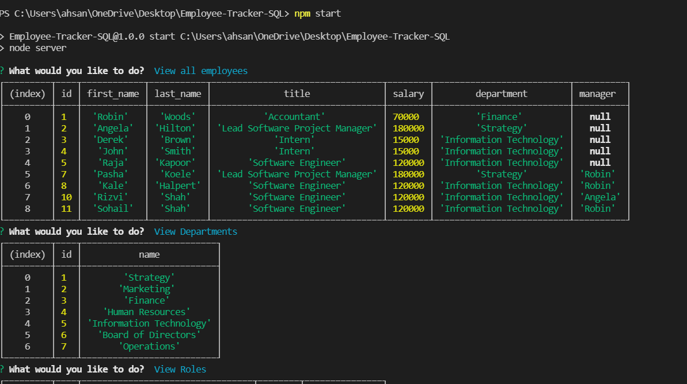
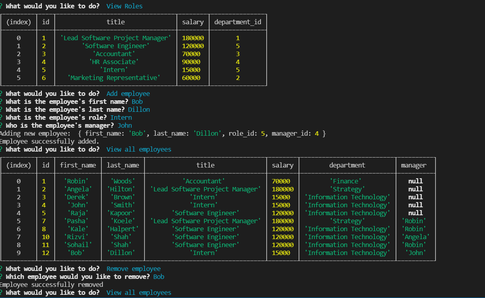

# Employee_Generator

## Description

This MySQL application that allows users to add, view, update and delete the employee, company, and department data stored in a database.

DEMO LINK: https://drive.google.com/file/d/11KtKJ7wyfymmpCIyQweKkKwlRmRnG9nW/view

## Useage

This Application allows the user to:

View departments, roles, employees and department budget

Add departments, roles, employees

Update employee roles, or employee managers

Delete departments, roles, and employees

## Installation

Dependencies neede for this project:

- SQL
- inquirer

To install, on Command line use: npm install

## Tests

use the command: npm start - To start using the app and making the changes

